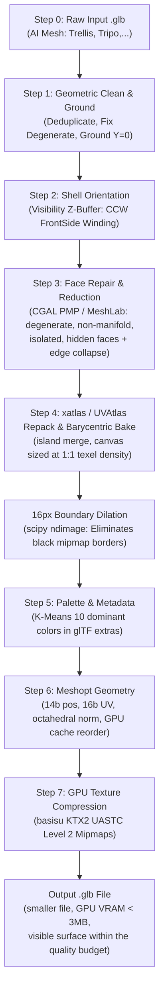

# 3D Model (.glb) Optimization Pipeline

[](LICENSE)
[](https://www.khronos.org/gltf/)
[](https://github.com/zeux/meshoptimizer)
[](https://github.com/KhronosGroup/KTX-Software)
[](#-key-features--pipeline-stages)

Production-grade, end-to-end 3D model (`.glb`) optimization pipeline designed for online 3D painting apps, WebGL 60 FPS rendering, and mobile devices (iOS Metal / Android Vulkan).

Takes a raw AI-generated 3D model (`.glb` from Trellis, Tripo, Rodin, etc.) and outputs a clean, ultra-compressed, production-ready `.glb` file.

Every step can be switched off individually, from the CLI (`--skip-steps`) or by unchecking it in the web UI; Step 0 and the final step always run.

---

## 🌟 Key Features & Pipeline Stages



1. **Step 3 - Face Repair & Reduction under a measured quality budget**:
   - Two interchangeable engines: **CGAL** [Polygon Mesh Processing](https://doc.cgal.org/latest/PMP_Mesh_repair/index.html) (a small C++ helper in `optimizer/cgal/`) and **[MeshLab](https://github.com/cnr-isti-vclab/meshlab)** via `pymeshlab`.
   - Five operations, each one optional: `repair` (degenerate, duplicate, non-manifold), `self_intersection` (opt-in: it removes every face of an intersecting pair), `isolated` (small disconnected components), `hidden` (faces no camera can see, from a 64-view z-buffer) and `merge` (edge collapse).
   - **Quality budget**: the *visible* surface may not move more than `--reduce-quality-budget` percent (default 0.1%) of the model's bounding box diagonal, measured against the mesh entering the step. `merge` bisects its target face count to find the most aggressive collapse that still fits. Deleting geometry buried inside the model is free by this measure, because nothing on screen changes.
   - **The removal operations never delete a face you can see unless the budget can pay for it.** `hidden` only ever touches faces no view reaches; `self_intersection` keeps the visible face of an intersecting pair; and if `repair` or `isolated` removed visible faces and the finished removal turns out to exceed the budget, those faces go back and the run continues. The deviation is measured on a seeded sample cloud, so the same model and settings always reduce to the same mesh.
   - Every step after Step 3 still preserves 100% of the triangles it is given, and `metrics.json` reports `zeroDecimationVerified` on that basis.
   - `merge` rewrites the topology and invalidates the model's UVs, so Step 4 then re-charts them and bakes the original texture back on through a closest-point projection (per texel, so a new triangle spanning two islands of the source atlas still samples the right pixels).
2. **Shell Orientation (Visibility Z-Buffer Raycasting)**:
   - Trellis AI models generate thin 2-layer open shells where exterior visible triangles often face backwards (normals pointing inward), causing hole artifacts under FrontSide shaders.
   - Vectorized Fibonacci sphere z-buffer rasterization tests 24–92 view angles and automatically flips connected components to outward CCW FrontSide winding without pruning faces.
3. **UV Island Merging (Step 4)**:
   - Charts the mesh at several island-merge levels and keeps the one whose islands need the smallest canvas at 1:1 texel density (`--merge-uv-islands off` charts once, with the default segmentation).
   - Fewer islands mean less chart border, and border is what the packer has to surround with gutter padding. `metrics.json` reports the island count, the island border length in texels and the canvas for every level tried.
4. **Flat-Colour Swatches (Step 4, `--flat-swatch on`)**:
   - A face whose source colour is uniform carries no detail, so it needs no texels of its own. Those faces are held out of the chart pass and each colour gets one 8x8 swatch in a strip along the bottom of the canvas, block-aligned so KTX2 reproduces it exactly.
   - A face only counts as flat when every re-baked slot (base colour, normal, metallicRoughness, occlusion, emissive) is uniform over it, and every sample of a swatched face is checked against the swatch colour it would get: no point ever moves further than `--flat-tolerance`.
   - The mesh is charted both ways and the smaller canvas wins, so the option can never grow the canvas; when it does not help, `metrics.json` records why in `flatSwatchDisabled`.
   - Measured at tolerance 20 (full pipeline, KTX2): koidrax 2612 -> 2272 canvas and 8.69 -> 6.56 MB VRAM, dinoki 1528 -> 1500.

5. **16px Boundary Dilation**:
   - Uses Euclidean distance transform (`ndimage.distance_transform_edt`) to bleed island boundary colors 16 pixels into black/transparent padding.
   - Triệt tiêu 100% viền đen khi GPU thu nhỏ mipmap texture.
6. **Angle-Weighted Smooth Vertex Normals**:
   - Thürmer & Wüthrich / Bærentzen & Aanaes algorithm with spatial vertex position hashing.
   - Vertices split across UV seams share continuous smooth normals, eliminating ugly light creases and seam cracks.
7. **EXT_meshopt_compression**:
   - Quantization: 14-bit position, 16-bit UV (`--keep-uv-float32` to opt out), octahedral-filtered normals.
   - GPU vertex cache reordering for maximum Metal/Vulkan throughput.
8. **Hardware GPU Texture Compression (Basis Universal KTX2 UASTC)**:
   - Encodes texture into KTX2 UASTC Level 2 RDO 1.0 with mipmaps using `basisu`.
   - Transcodes on-the-fly to GPU native compressed formats (ASTC on iOS/Android, BC7 on Desktop).
   - Drastically lowers GPU VRAM from ~32 MB down to **~2–3 MB**.

---

## 📋 System Requirements

- **Python**: `>= 3.10` (tested on 3.11, 3.12). `pymeshlab` and `open3d` (in `requirements.txt`) carry Step 3's MeshLab engine and its quality measurement.
- **CGAL** (the Step 3 default engine): `optimizer/cgal/build.sh` builds the `mesh_repair` helper. It finds CGAL and Boost through `$CGAL_DIR` / `$BOOST_ROOT`, an installed copy (`brew install cgal`), or headers vendored under `third_party/`. `setup.sh` runs it and carries on with a warning when it cannot build; run with `--reduce-engine meshlab` until it does.
- **Node.js**: `>= 18 LTS` (tested on Node 20 LTS)
- **`basisu` CLI**: Official Google / Binomial Basis Universal toolchain
  - **macOS**: `brew install basisu`
  - **Ubuntu / Debian**: `sudo apt-get update && sudo apt-get install -y basisu`

---

## ⚡ Quick Start (1-Step Installation)

Clone the repository and run the automated setup script:

```bash
git clone https://github.com/braitoli/poc-optimize-3d-model.git
cd poc-optimize-3d-model

# Automatically configures Python virtualenv, installs pip & npm packages:
./setup.sh
```

---

## 🚀 Usage

### Basic Command (Single File)

```bash
./bin/optimize-3d input.glb output.glb
```

`bin/optimize-3d` runs the step pipeline (`optimizer/step_pipeline.py`) in a temporary directory and copies its final step, `step_07_final.glb`, to the output path.

To keep all 8 intermediate step files and `metrics.json`, run the step pipeline directly:

```bash
python3 -m optimizer.step_pipeline input.glb --output-dir out/
```

### CLI Options

| Flag | Short | Default | Description |
|---|---|---|---|
| `--downscale` | | `on` | `on`: re-chart UVs on a canvas sized by `--size-mode` (original UVs & texture kept when that canvas is not smaller than the original texture); `off`: keep original UVs, texture and resolution |
| `--size-mode` | | `exact` | Canvas at the source's 1:1 texel density: `exact` (smallest square, multiple of 4), `pot-up` (power of two, 1:1 or better), `pot-down` (power of two, islands scaled down) |
| `--format` | `-f` | `ktx2` | GPU texture format (`ktx2`, `webp` or `original`) |
| `--uv-mode` | | `xatlas` | UV unwrap mode (`xatlas` or `uvatlas`) |
| `--merge-uv-islands` | | `on` | Step 4: chart at several island-merge levels and keep the one whose islands need the smallest canvas (less chart border, hence less gutter padding) |
| `--flat-swatch` | | `off` | Step 4: keep faces whose source colour is uniform out of the chart pass and give each colour one small swatch, so the canvas only holds the faces that carry detail |
| `--flat-tolerance` | | `8` | Step 4 (`--flat-swatch on`): per-channel spread (0..255) a face may show and still count as flat. No point of a swatched face ever moves further than this |
| `--smooth-normals` / `--no-smooth-normals` | | on | Step 6: angle-weighted smooth vertex normals welded across UV seams, which heals the shading seam a UV split leaves and drops the duplicate vertices with it. Only vertices whose normals already agree are welded, so hard edges survive: welding each position whole flattened every crease in the model (dinoki: 5,195 creased positions in, 0 out) |
| `--flat-min-group-faces` | | `16` | Step 4 (`--flat-swatch on`): smallest flat group held out of the chart pass; cutting a tiny hole costs more chart border than the texels it saves |
| `--skip-steps` | | *(none)* | Comma-separated steps to skip, e.g. `3,5`. Steps 1-6 are optional; Step 0 and Step 7 always run |
| `--reduce-engine` | | `cgal` | Step 3 engine: `cgal` (the `optimizer/cgal` helper) or `meshlab` (pymeshlab). At a tight budget CGAL reduces far more: koidrax at 0.1% is -66% with CGAL and -6% with MeshLab |
| `--reduce-ops` | | `repair,isolated,hidden,merge` | Step 3 operations, any subset of `repair`, `self_intersection`, `isolated`, `hidden`, `merge` |
| `--reduce-quality-budget` | | `0.1` | How far Step 3 may move the visible surface, as a percentage of the bounding box diagonal |
| `--reduce-normal-budget` | | `auto` | How far Step 3 may let the surface turn, in degrees at the 99th percentile. A collapse can round a crease away while barely moving the surface, so this is what keeps sharp edges and narrow slots. `auto` reads the angle off the model - how far its surface already turns from one face to the next, floored at 3° - because a fixed angle means a different thing on every model: 8° buys dinoki (6.2°/edge) 1.3 edges of collapse and tigravolt (2.1°/edge) 3.8 |
| `--reduce-normal-factor` | | `1` | Only when `--reduce-normal-budget` is `auto`: how many edges' worth of the curvature the mesh already carries one collapse may erase. Measured, no property of a mesh predicts it - vosiruto wants ~7 (1.2M -> 44k triangles and still crisp) and zelvaron ~1, while their per-edge turn differs by 1.5x and their crease density by 1.3x - so it is a per-model setting |
| `--reduce-isolated-min-faces` | | `25` | Step 3 `isolated`: components with fewer faces than this are removed |
| `--double-sided` | | `False` | Keep DoubleSided material (default: FrontSide) |
| `--quiet` | `-q` | `False` | Suppress progress logs |

### Examples

**1. Default (downscale on, exact 1:1 canvas, KTX2)**:
```bash
./bin/optimize-3d input.glb output.glb
```

**2. Power-of-Two Canvas / Keep Original Texture**:
```bash
./bin/optimize-3d input.glb output_pot.glb --size-mode pot-up
./bin/optimize-3d input.glb output_orig.glb --downscale off
```

**3. WebP Fallback Format**:
```bash
./bin/optimize-3d input.glb output.glb --format webp
```

**4. Tune or switch off the face reduction**:
```bash
# Looser quality budget: many more triangles removed, surface allowed to move further
python3 -m optimizer.step_pipeline input.glb --output-dir out/ --reduce-quality-budget 0.5

# CGAL engine, and also cut self-intersecting faces
python3 -m optimizer.step_pipeline input.glb --output-dir out/ --reduce-engine cgal \
    --reduce-ops repair,self_intersection,isolated,hidden,merge

# Keep every triangle: skip Step 3 entirely (strict zero-decimation, as before)
python3 -m optimizer.step_pipeline input.glb --output-dir out/ --skip-steps 3
```

---

## 🧪 Representative Models & Batch Testing

The repository includes **16 representative 3D models** under `examples/models/` spanning diverse geometries, polycounts, and characters from the 3D Painting catalog (including raw AI generations, cleaned baselines, and production-optimized variants):

| # | Model File | Character Name | Character Type / Variant | Size | Faces |
|---|---|---|---|---|---|
| 1 | `dinoki_raw.glb` | **Dinoki** | Khủng Long T-Rex Chibi (Raw) | 1.9 MB | 45.0K |
| 2 | `vulparon_raw.glb` | **Vulparon** | Cáo Linh Thú (Raw AI) | 10.3 MB | 282.4K |
| 3 | `flamibo_raw.glb` | **Flamibo** | Chim Hồng Hạc (Raw AI) | 11.4 MB | 295.1K |
| 4 | `gravilux_raw.glb` | **Gravilux** | Quái Thú Đá (Raw AI) | 11.4 MB | 289.6K |
| 5 | `lumiflora_raw.glb` | **Lumiflora** | Linh Thú Hoa (Raw AI) | 12.5 MB | 298.0K |
| 6 | `tigravolt_raw.glb` | **Tigravolt** | Hổ Sấm Sét (Raw AI) | 11.6 MB | 280.7K |
| 7 | `vosiruto_raw.glb` | **Vosiruto** | Chiến Binh Sấm Sét (Raw AI) | 34.4 MB | 1.21M |
| 8 | `koidrax_raw.glb` | **Koidrax** | Rồng Cá Chép (Raw AI) | 11.8 MB | 289.6K |
| 9 | `koidrax_opt_2k.glb` | **Koidrax 2K** | Rồng Cá Chép (2K Production) | 7.6 MB | 289.6K |
| 10 | `koidrax_restored.glb` | **Koidrax Restored** | Rồng Cá Chép (Clean Restored) | 7.6 MB | 289.6K |
| 11 | `zelvanox_raw.glb` | **Zelvanox** | Rùa Cơ Giới / Zarek (Raw AI) | 8.5 MB | 257.6K |
| 12 | `zelvanox_opt.glb` | **Zelvanox Opt** | Rùa Cơ Giới (Production Shell) | 4.2 MB | 257.6K |
| 13 | `zelvaron_raw.glb` | **Zelvaron** | Linh Thú / Nữ Hiệp Sĩ (Raw AI) | 11.4 MB | 294.8K |
| 14 | `zelvaron_opt.glb` | **Zelvaron Opt** | Linh Thú (Production Shell) | 4.8 MB | 294.8K |
| 15 | `coramini.glb` | **Coramini** | Rùa San Hô Biển (Production) | 6.8 MB | 140.0K |
| 16 | `flamibo_baseline.glb`| **Flamibo Baseline** | Bản Hình Học Sạch (Clean Geometry) | 2.9 MB | 95.0K |

### Quick Single Test

```bash
# Run test on default sample model:
./examples/run_sample.sh
```

### Batch Test Runner

Optimize any or all representative models with a single command:

```bash
# 1. Run quick test on first 3 models:
./examples/batch_test.sh

# 2. Run on a specific model by name:
./examples/batch_test.sh dinoki
./examples/batch_test.sh koidrax
./examples/batch_test.sh zelvanox
./examples/batch_test.sh zelvaron

# 3. Run on all models:
./examples/batch_test.sh --all
```

### Automated Unit & E2E Tests

```bash
pytest tests/
```

---

## 🐳 Docker Usage

Run anywhere without local dependencies:

```bash
# Build container
docker build -t poc-optimize-3d-model .

# Run optimization on a mounted file
docker run --rm -v "$(pwd):/data" poc-optimize-3d-model /data/examples/sample_input.glb /data/output.glb
```

---

## 📊 Benchmark Results

Measured in production across 7 3D statues (Dinoki, Koidrax, Vulparon, Flamibo, Gravilux, Lumiflora, Tigravolt):

| Metric | Raw AI Input | Optimized (1K KTX2) | Reduction |
|---|---|---|---|
| **File Size** | 18.5 MB – 28.0 MB | **1.7 MB – 2.5 MB** | **-88% to -92%** |
| **Triangles** (Step 3 skipped) | 45,000 – 280,000 | **45,000 – 280,000** | **0% (100% Preserved)** |
| **GPU VRAM** | ~32 MB | **~2.3 MB** | **-93%** |
| **Load Time** | ~4.2s (stutter) | **~0.15s (instant 60fps)** | **28x faster** |

With Step 3 enabled, the triangle count drops much further. At the default 0.1% quality budget Dinoki goes from 45,000 to 15,005 triangles (-67%) and stays visually identical; raising the budget trades that for size:

| `--reduce-quality-budget` | Dinoki triangles | Reduction | Measured deviation |
|---|---|---|---|
| `0.1` (default) | 15,005 | -66.7% | 0.10% |
| `0.5` | 3,822 | -91.5% | 0.42% |
| `2.0` | 679 | -98.5% | 1.88% |

At 2% the silhouette is visibly faceted; at 0.5% and below it is not.

---

## 📄 License

MIT License. Developed for the Braitoli 3D Painting Ecosystem.
