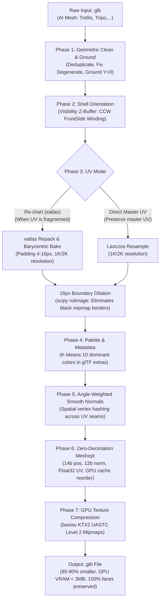

# 3D Model (.glb) Optimization Pipeline (Zero-Decimation)

[](LICENSE)
[](https://www.khronos.org/gltf/)
[](https://github.com/zeux/meshoptimizer)
[](https://github.com/KhronosGroup/KTX-Software)
[](#rule-11-zero-decimation-policy)

Production-grade, end-to-end 3D model (`.glb`) optimization pipeline designed for online 3D painting apps, WebGL 60 FPS rendering, and mobile devices (iOS Metal / Android Vulkan).

Takes a raw AI-generated 3D model (`.glb` from Trellis, Tripo, Rodin, etc.) and outputs a clean, ultra-compressed, production-ready `.glb` file **while strictly preserving 100% of the original geometric triangles**.

---

## 🌟 Key Features & Pipeline Stages



1. **Rule 11 (Strict Zero-Decimation Policy)**:
   - **Never decimates or reduces mesh triangles** (`--ratio 1.0`).
   - Prevents flat surface artifacts, split UV seams, distorted texel density, and anatomical loss common with decimation algorithms (QEM, quadric decimate, fast-simplification).
2. **Shell Orientation (Visibility Z-Buffer Raycasting)**:
   - Trellis AI models generate thin 2-layer open shells where exterior visible triangles often face backwards (normals pointing inward), causing hole artifacts under FrontSide shaders.
   - Vectorized Fibonacci sphere z-buffer rasterization tests 24–92 view angles and automatically flips connected components to outward CCW FrontSide winding without pruning faces.
3. **16px Boundary Dilation**:
   - Uses Euclidean distance transform (`ndimage.distance_transform_edt`) to bleed island boundary colors 16 pixels into black/transparent padding.
   - Triệt tiêu 100% viền đen khi GPU thu nhỏ mipmap texture.
4. **Angle-Weighted Smooth Vertex Normals**:
   - Thürmer & Wüthrich / Bærentzen & Aanaes algorithm with spatial vertex position hashing.
   - Vertices split across UV seams share continuous smooth normals, eliminating ugly light creases and seam cracks.
5. **EXT_meshopt_compression**:
   - Quantization: 14-bit position, 12-bit normal, **preserving Float32 UV** (`--keep-uv-float32`) to protect painted details.
   - GPU vertex cache reordering for maximum Metal/Vulkan throughput.
6. **Hardware GPU Texture Compression (Basis Universal KTX2 UASTC)**:
   - Encodes texture into KTX2 UASTC Level 2 RDO 1.0 with mipmaps using `basisu`.
   - Transcodes on-the-fly to GPU native compressed formats (ASTC on iOS/Android, BC7 on Desktop).
   - Drastically lowers GPU VRAM from ~32 MB down to **~2–3 MB**.

---

## 📋 System Requirements

- **Python**: `>= 3.10` (tested on 3.11, 3.12)
- **Node.js**: `>= 18 LTS` (tested on Node 20 LTS)
- **`basisu` CLI**: Official Google / Binomial Basis Universal toolchain
  - **macOS**: `brew install basisu`
  - **Ubuntu / Debian**: `sudo apt-get update && sudo apt-get install -y basisu`

---

## ⚡ Quick Start (1-Step Installation)

Clone the repository and run the automated setup script:

```bash
git clone https://github.com/braitoli/poc-optimize-3d-model.git
cd poc-optimize-3d-model

# Automatically configures Python virtualenv, installs pip & npm packages:
./setup.sh
```

---

## 🚀 Usage

### Basic Command (Single File)

```bash
./bin/optimize-3d input.glb output.glb
```

Or via Python directly:

```bash
python3 -m optimizer.cli input.glb output.glb
```

### CLI Options

| Flag | Short | Default | Description |
|---|---|---|---|
| `--resolution` | `-r` | `1024` | Target texture dimension (`512`, `1024`, `2048`, `4096`) |
| `--format` | `-f` | `ktx2` | GPU texture format (`ktx2` or `webp`) |
| `--rechart` | | `False` | Re-chart and repack UV atlas with xatlas |
| `--no-smooth-normals` | | `False` | Disable angle-weighted smooth normals across seams |
| `--double-sided` | | `False` | Keep DoubleSided material (default: FrontSide) |
| `--json` | | `False` | Output result as machine-readable JSON |
| `--quiet` | `-q` | `False` | Suppress non-error console logs |

### Examples

**1. Standard Mobile 1K KTX2 (Default)**:
```bash
./bin/optimize-3d input.glb output_1k.glb
```

**2. High-Fidelity 2K Texture**:
```bash
./bin/optimize-3d input.glb output_2k.glb --resolution 2048
```

**3. With xatlas UV Repacking (for broken AI UVs)**:
```bash
./bin/optimize-3d input.glb output.glb --rechart
```

**4. WebP Fallback Format**:
```bash
./bin/optimize-3d input.glb output.glb --format webp
```

---

## 🧪 Running the Sample Test

A sample raw 3D model (`Dinoki` raw chibi dinosaur, 45,000 triangles) is included:

```bash
./examples/run_sample.sh
```

To run unit and end-to-end tests:

```bash
pytest tests/
```

---

## 🐳 Docker Usage

Run anywhere without local dependencies:

```bash
# Build container
docker build -t poc-optimize-3d-model .

# Run optimization on a mounted file
docker run --rm -v "$(pwd):/data" poc-optimize-3d-model /data/examples/sample_input.glb /data/output.glb
```

---

## 📊 Benchmark Results

Measured in production across 7 3D statues (Dinoki, Koidrax, Vulparon, Flamibo, Gravilux, Lumiflora, Tigravolt):

| Metric | Raw AI Input | Optimized (1K KTX2) | Reduction |
|---|---|---|---|
| **File Size** | 18.5 MB – 28.0 MB | **1.7 MB – 2.5 MB** | **-88% to -92%** |
| **Triangles** | 45,000 – 280,000 | **45,000 – 280,000** | **0% (100% Preserved)** |
| **GPU VRAM** | ~32 MB | **~2.3 MB** | **-93%** |
| **Load Time** | ~4.2s (stutter) | **~0.15s (instant 60fps)** | **28x faster** |

---

## 📄 License

MIT License. Developed for the Braitoli 3D Painting Ecosystem.
